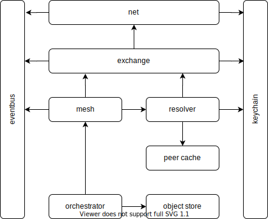

<h1 align="center">
  
</h1>
<h4 align="center">a new internet stack; or something like it.</h4>


<p align="center">
  <a href="https://github.com/nimona/go-nimona/actions">
    
  </a>
  <a href="https://codeclimate.com/github/nimona/go-nimona">
    
  </a>
  <a href="https://github.com/nimona/go-nimona/commits/master">
    
  </a>
  <a href="https://github.com/nimona/go-nimona/issues">
    
  </a>
  <a href="https://github.com/nimona/go-nimona/pulls">
    
  </a>
  <a href="https://github.com/nimona/go-nimona/blob/master/LICENSE">
    
  </a>
</p>

---

__WARNING__: Nimona is still in its very early stages of design and development
and will stay like this for a while.  
Documentation is slowly starting to pop up, but everything is still pretty much
in flux.

---

# Nimona

Nimona’s main goal is to provide a number of layers/components to help with
the challenges presented when dealing with decentralized and peer to peer
applications.

## Development

### Requirements

- Go 1.13+ with modules enabled
- Make

### Getting Started

```
git clone https://github.com/nimona/go-nimona.git go-nimona
cd go-nimona
make deps
```

### Process / Workflow

Nimona is developed using [Git Common-Flow](https://commonflow.org/), which is
essentially [GitHub Flow](http://scottchacon.com/2011/08/31/github-flow.html)
with the addition of versioned releases, and optional release branches.

In addition to the Common-Flow spec, contributors are also highly encouraged to
[sign commits](https://git-scm.com/book/en/v2/Git-Tools-Signing-Your-Work).

## Library Architecture



### Network

Package `exchange` is responsible for a number of things around connections and
object exchange, as well as relaying objects to inaccessible peers.

```go
type Network interface {
    Subscribe(
        filters ...EnvelopeFilter,
    ) EnvelopeSubscription
    Send(
        ctx context.Context,
        object object.Object,
        recipient *peer.Peer,
    ) error
    Listen(
        ctx context.Context,
        bindAddress string,
    ) (Listener, error)
}
```

### Resolver

Package `resolver` is responsible for looking up peers on the network that
fulfill specific requirements.

```go
type Resolver interface {
    Lookup(
        ctx context.Context,
        opts ...LookupOption,
    ) (<-chan *peer.Peer, error)
}
```

The currently available `LookupOption` are the following, and can be used
on their own or in groups.

```go
func LookupByContentHash(hash object.Hash) LookupOption { ... }
func LookupByContentType(contentType string) LookupOption { ... }
func LookupByIdentity(key crypto.PublicKey) LookupOption { ... }
func LookupByCertificateSigner(key crypto.PublicKey) LookupOption { ... }
```

<!-- Links -->

[Go environment]: https://golang.org/doc/install

<!-- Badge images -->

[Actions Status]: https://github.com/nimona/go-nimona/workflows/CI/badge.svg?style=flat
[License Status]: https://img.shields.io/github/license/nimona/go-nimona.svg?style=flat
