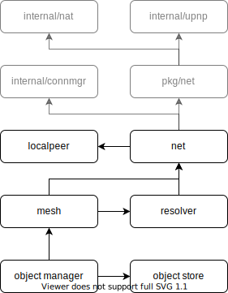

<h1 align="center">
  
</h1>
<h4 align="center">a new internet stack; or something like it.</h4>


<p align="center">
  <a href="https://github.com/nimona/go-nimona/actions">
    
  </a>
  <a href="https://github.com/nimona/go-nimona/commits/master">
    
  </a>
  <a href="https://github.com/nimona/go-nimona/issues">
    
  </a>
  <a href="https://github.com/nimona/go-nimona/pulls">
    
  </a>
  <a href="https://github.com/nimona/go-nimona/blob/master/LICENSE">
    
  </a>
</p>

---

__WARNING__: Nimona is still in its very early stages of design and development and will stay like this for a while.  
Documentation is currently non existent but should start slowly popping up as the various design decisions mature.

---

# Nimona

Nimona’s main goal is to provide a number of layers/components to help with the challenges presented when dealing with decentralized and peer to peer applications.

## Development

### Requirements

- Go 1.13+ with modules enabled
- Make

### Getting Started

```
git clone https://github.com/nimona/go-nimona.git go-nimona
cd go-nimona
make deps
```

### Process / Workflow

Nimona is developed using [Git Common-Flow](https://commonflow.org/), which is
essentially [GitHub Flow](http://scottchacon.com/2011/08/31/github-flow.html)
with the addition of versioned releases, and optional release branches.

In addition to the Common-Flow spec, contributors are also highly encouraged to
[sign commits](https://git-scm.com/book/en/v2/Git-Tools-Signing-Your-Work).

## Library Architecture



### Network

Package `net` provides access to the basic nimona networking primitives
allowing peers to connect to each other and perform negotiate their
identities, certificates, and capabilities (via handshake).

A valid `peer.Peer` is required that includes both a public key, and one or
more network addresses.

Currently the only supported protocol for peer communication is TCP over TLS.
Such addresses are prefixed with `tcps:` followed by an ip address and port.

Network keeps a blacklist that will exponentially back-off attempts to dial
unresponsive addresses.

Upon successful connection and handshake, the resulting `net.Connection` will
hold the remote peer's keys, certificates, and capabilities.

```go
    type Network interface {
        Dial(ctx context.Context, peer *peer.Peer) (*Connection, error)
        Listen(ctx context.Context, bindAddress string) (Listener, error)
        Accept() (*Connection, error)
        Addresses() []string
  }
```

### Connection Manager

Package `connmanager` wraps `net.Network` in order to cache open connections
when a peer with an open connection is being re-dialed.

```go
type Network interface {
    Dial(ctx context.Context, peer *peer.Peer) (*Connection, error)
}
```

### Exchange

Package `exchange` is responsible to sending and receiving objects to from
peers.

```go
type Exchange interface {
    Send(ctx context.Context, object object.Object, p *peer.Peer) error
    Subscribe(filters ...EnvelopeFilter) EnvelopeSubscription
}
```

### Resolver

Package `resolver` is responsible for looking up peers on the network that
fulfill specific requirements.

```go
type Resolver interface {
  Lookup(ctx context.Context, opts ...LookupOption) (<-chan *peer.Peer, error)
}
```

The currently available `LookupOption` are the following, and can be used
on their own or in groups.

```go
func LookupByContentHash(hash object.Hash) LookupOption { ... }
func LookupByContentType(contentType string) LookupOption { ... }
func LookupByIdentity(key crypto.PublicKey) LookupOption { ... }
func LookupByCertificateSigner(key crypto.PublicKey) LookupOption { ... }
```

### Mesh

Package `mesh` merges `exchange` and `resolver`.
Instead of being able to send objects to specific peers, it accepts resolver
lookup options in order to figure out which peers it needs to send objects to.

```go
type Mesh interface {
    Send(ctx context.Context, object object.Object, options LookupOption) error
}
```

`mesh` is also responsible for relaying objects when a peer is not directly
accessible.

### Orchestrator

Package `orchestrator` deals with creating, updating, getting, and synchronizing
streams.

<!-- Links -->

[Go environment]: https://golang.org/doc/install

<!-- Badge images -->

[Actions Status]: https://github.com/nimona/go-nimona/workflows/CI/badge.svg?style=flat
[License Status]: https://img.shields.io/github/license/nimona/go-nimona.svg?style=flat
