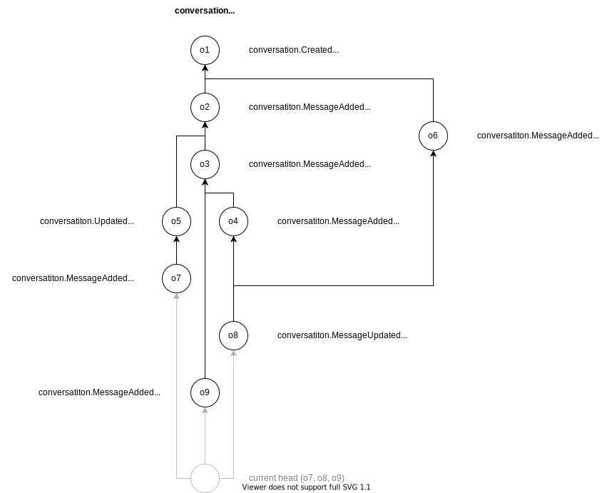

# Streams

## Simple Summary

Streams provide a way of creating complex mutable data structures using
directed acyclic graphs made from objects.

## Problem Statement

While objects on their own are useful for creating permanent content-addressable
data structures, there are very few applications where data never get updated.
This is where streams come in, they allow developers to create complex
applications by applying event driven and event sourcing patterns using graphs
of individually immutable objects.

## Proposal

Objects in a stream form a directed acyclic graph (DAG) by allowing each of the
objects to reference others it depends on or knows of. This graph can then be
serialized into a linear series of objects that can be replayed consistently by
everyone that has the same representation of the graph.

Streams are identified by the hash of their root object. This means that even
though each of their objects is content-addressable; the stream as a whole is
not, as its root hash (and thus identifier) does not change when more objects
are added to the graph.

The benefit of this is that there is no need to find a way to reference the
stream as it changes. The downside is that you do not really know if you have
actually  received the whole stream and whether peers are not holding back on
you.



## Structure

```json
{
    "type:s": "stream:nimona.io/kv",
    "data:m": {}
}
```

## Access control policy

_Note: Work in progress._

* `type` required. [`signature`].
* `subjects` optional (public key).
* `actions` optional [`read`, `append`].
* `resources` optional (only used for stream policies).
* `effect` required [`allow`, `deny`].

The decision about whether an action is allowed or not is reached after
applying the following rules:

0. If no policies are provided, the object is considered public.
1. If a policy for a given subject, action, and resource matches, and the
  effect is deny, the request is always denied.
2. If no policy with effect deny matches, and at least one policy with effect
  allow, the request is allowed.
3. If no policies match at all, the request is denied.

### Example

```json
{
  "type:s": "stream:conversation",
  "owner:s": "bah0",
  "policies:am": [{
    // allow everyone to read the whole stream
    "type:s": "signature",
    "actions:as": ["read"],
    "effect:s": "allow",
  }, {
    // allow a couple of keys to send messages
    "type:s": "signature",
    "subjects:as": ["bah1", "bah2", "bah3"],
    "actions:as": ["append"],
    "resources:as": ["conversation.MessageAdded"],
    "effect:s": "allow",
  }, {
    // allow owner to modify conversation topic
    "type:s": "signature",
    "subjects:as": ["bah0"],
    "actions:as": ["append"],
    "resources:as": ["conversation.TopicUpdated"],
    "effect:s": "allow",
  }]
}
```

## Hypothetical roots

As mentioned before, streams are identified by the hash of their root object. In
order for a peer to find the providers of a stream and get its objects, it must
at the very least know its identifier. This is usually not an issue as most
times a peer will learn about the existence of a stream from somewhere before
deciding to request it. There are some cases though where that might not be the
case, especially when looking for something that might be considered relatively
"well known".

An example of this would be the profile stream of an identity. Let's say we are
looking at a blog post that a single author. Unless the blog post somehow
contains a link to the author's profile stream, there is no other way to easily
find the stream's identifier.

This is where hypothetical roots come in.

A hypothetical root is an object that identifies a stream and can be assumed
exists given the type of stream and the author that would have created it. This
allows peers to find streams unique to an identity without having to somehow
learn of their existence.

Since the hypothetical root does not contain a policy, the stream starts off as
publicly accessible but writable only by the author. The author can subsequently
decide to restrict the rest of the stream by using a more strict policy.

---

Let's go back to our original example of profile streams.

Assuming that peer `a11` wants the profile stream for the identity `f00`, all it
has to do is construct the hypothetical root, calculate its hash, and find
providers for it on the network.

```json
{
  "type:s": "nimona.io/profile.Created",
  "author:s": "f00"
}
```

The hash of this object is `oh1.9KQhQ4UGaQPEyUDAAPDmVJCoHnGtJY7Aun4coFATXCYK`
and the peer can now lookup the providers for this object, and sync the
remaining stream.

---

The NDL for defining hypothetical roots is as follows. Additional objects can be
defined in the stream as needed, but the hypothetical root object itself cannot
have additional properties.

```ndl
stream nimona.io/profile {
    hypothetical root object Created { }
    signed object NameUpdated {
        nameFirst string
        nameLast string
        dependsOn repeated relationship
    }
}
```

## Synchronization

_Note: Work in progress._

```ndl
    signed object nimona.io/stream.StreamRequest {
        nonce string
        leaves repeated nimona.io/object.Hash
    }
```

```ndl
    signed object nimona.io/stream.StreamResponse {
        nonce string
        children repeated nimona.io/object.Hash
    }
```

```ndl
    signed object nimona.io/stream.Announcement {
        nonce string
        leaves repeated nimona.io/object.Hash
    }
```

## Subscriptions

Peers can "subscribe" to stream updates by creating and sending subscriptions to
other peers. A subscription can be used to subscribe on updates to one or more
streams using the streams' root hash and must also specify an expiration time
for the subscription.

When a peer receives or creates an update for a stream, they will go through the
subscriptions they have received, and notify the relevant peers about the new
updates. If the subscriber does not have have access to the stream, no
notification will be sent.

```ndl
signed object nimona.io/stream.Subscription {
    rootHashes nimona.io/object.Hash
    expiry nimona.io/object.DateTime
}
```

Subscriptions can also be added as stream events. This allows identities and
peers that have write access to a stream to denote their interest in receiving
updates about that stream. In this case `rootHashes` should be empty and the
expiry is optional.

## References

* <https://docs.textile.io/threads/#threads>
* <https://www.streamr.com/docs/streams>
* <https://holochain.org>
* <https://github.com/textileio/go-textile/issues/694>
* <https://tuhrig.de/messages-vs-events-vs-commands>
* <https://www.swirlds.com/downloads/SWIRLDS-TR-2016-01.pdf>
* <https://arxiv.org/pdf/1710.04469.pdf>
* <http://archagon.net/blog/2018/03/24/data-laced-with-history>
