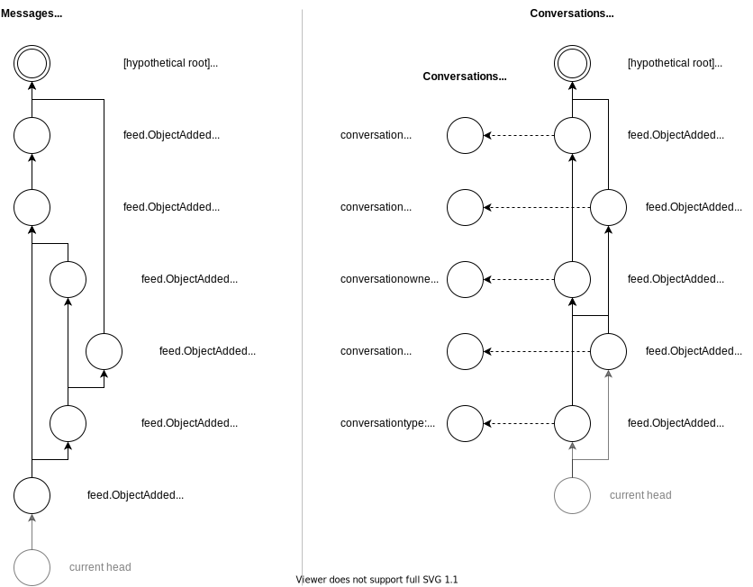

# Feeds

Feeds enable multiple peers that have been certified by the same identity to keep track and synchronize objects the create and receive.
Each peer has a number of "registered types" that they are responsible for.
For each of those types, a feed will be created and synchronized with peers of the same identity.

