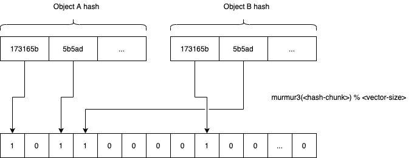

# Hyperspace v2

## Problem statement: Current approaches and issues

So far we've tried two main approaches to peer and content discovery.

### v0. DHT

The first POC (v0) was a DHT based on Kademlia which is a tried and true
solution for many peer-to-peer networks. The main issues with this approach
was the high cost (in terms of network requests) of keeping the network up
to date with what each peer has to offer. In addition to that DHTs make it
hard to hide what you are offering or what you are looking for.
There are a number of attempts at privacy preserving DHTs but they are not
fun.

## v1. Hyperspace

The second attempt was a proof-of-concept discovery protocol based around
using multi-dimensional vectors created from content hash ngrams.
Each peer creates an empty vector, splits the hashes of the content they
wish to advertise in 3 char chunks, hashes them with murmur3 and adds them.
They then publish their peer information including this vector to the "closest"
peers. In order to calculate proximity the dot product of each known peer's
vector is calculated and the outcome the result the closest the peers are.
For finding peers, the same process is used in order to create a query vector
which is then sent to the closest peers.
This works on a small scale but the network will become unreliable as peers'
vectors get bigger and the proximity metric starts to become ineffective.

The two main benefits of this approach is that its queries don't expose what
the peer is looking for and the fact that peers don't have to spam the network
with each new content they want to advertise.
Since we are using multidimensional vectors it should be relatively easy to
start supporting other forms of content discovery that is not based on the
content's hash.

### Issues

There is another more inherent problem with both these approaches, and that
is the fact that they are both pretty demanding in terms of cpu, memory,
and bandwidth. Peers participating in the network have to constantly be
sending queries to keep a list of healthy peers, as well as continuously
advertise themselves and the content they can provide so they aren't
forgotten by the mesh.

This is especially hard for applications on mobile phones or other low
power/bandwidth devices as actively participating in the network costs both
battery and bandwidth.

## Proposal: Dense vector based queries on a super-peer subset

This proposal aims to continue the work of the current discovery protocol,
but instead of trying to find a way to distribute the vectors and queries
across all peers on the network, delegate this responsibility to a sub set
of the network's peers.

The main goals of this update are the following:

- Reduce computation and communication cost of the largest percentage of peers
- Reduce time required to discover peers providing content

### Separation of concerns

Instead of treating all peers as equals, we will be separating them into
two distinct groups based on their capabilities; "hyperspace providers"
and "hyperspace clients".

Clients will only need to keep a small list of healthy providers and they
should be able to trust these won't go away, or at least won't go away often.
They also only need to advertise their information and the content they
provide to one or more of these providers when either gets updated
[or if more than x minutes have passed].
[If the provider does not have an answer to the query it can optionally
return a number of provider the peer can query.]

Providers are responsible for receiving and storing peer announcements
for a minimum amount of time in order to be able to respond to queries.
Partitioning of the vectors across hyperspace providers will be handled in
different ways throughout the evolution of the protocol and more
information can be found later in the document.

A simpler discover protocol also means it will be easier for developers to
implement and debug.

### Hyperspace v2.0

In the first version of the network, and while the number of peers and
advertised content is small, the providers will be gossiping everything
between them and thus should all have a complete and common understanding
of the mesh.

We will also be moving away from creating the vectors from ngrams but rather
opt for hashing the content id with murmur3 multiple (3 for now) times with
a an incremental seed (0, 1, 2), and adding all hashes to the vector.
This makes the vector into something resembling a bloom filter but whether
it improves anything will have to be seen.

### Hyperspace v2.1

In order to move away from the centralised nature of the previous version,
the providers will form a structured overlay network that will be used to
partition the data. There are a number of options on how to go forward with
this and additional research will be required.

[In order to reduce the required queries the clients would need, we could
make sure that we always replicate the partitioning index to all providers.]

### Messages

- **Query**
  Allows looking for peers matching any or all of the bellow:
  - Public keys
  - Certificates
  - Capabilities
  - Content vector
- **Announce** 
  A client informing a provider about their existence or updated information.
- **Remove**
  A client informing a provider they will be departing the network and that
  their information should no longer be advertised.
- **Report**
  A client informing a provider of another client being unresponsive or
  behaving badly. This should be better defined.

## Concerns

- Centralisation of discovery
- Discovery providers require way more computational resources than normal peers

## Literature

- [Kademlia: A peer-to-peer Information System Based on the COR Metric](https://pdos.csail.mit.edu/~petar/papers/maymounkov-kademlia-lncs.pdf)
- [Bloofi: Multidimensional Bloom Filters](https://core.ac.uk/download/pdf/35146789.pdf)
- [Supporting Complex Multi-dimensional Queries in P2P Systems](http://www.cse.psu.edu/~wul2/Publications/wlee%20icdcs05b.pdf)
- [Designing a Super-Peer Network](http://ilpubs.stanford.edu:8090/594/1/2003-33.pdf)